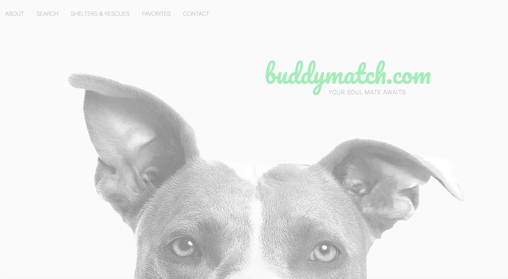
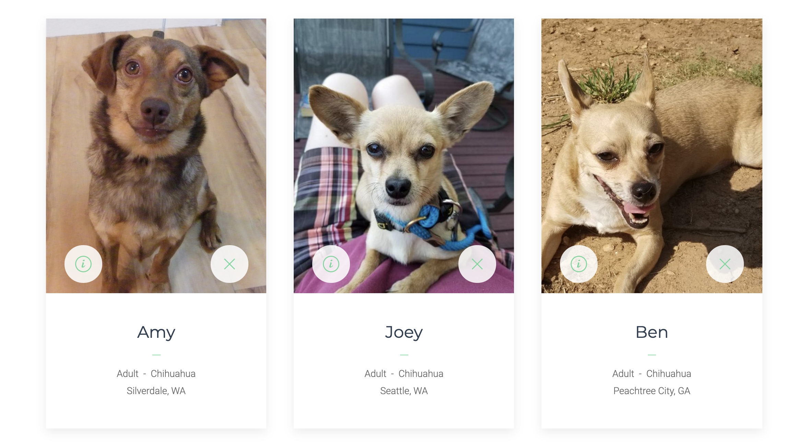
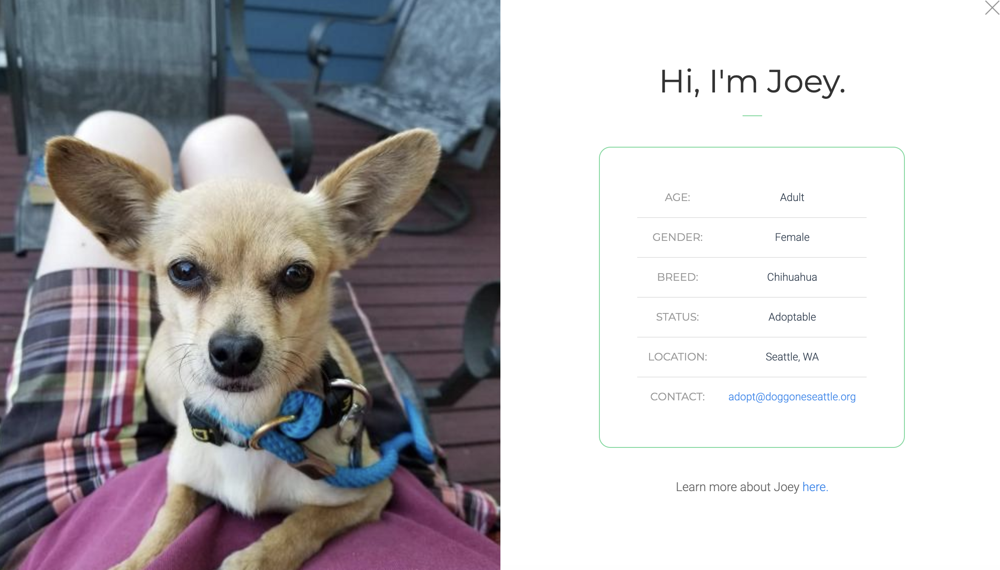
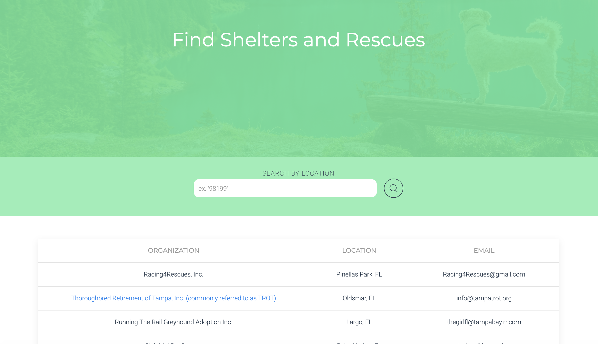

# [Buddy Match](https://buddy-match-dotcom.herokuapp.com/)

Buddy Match is a dog adoption application that pulls data fom The Pet Finder API and allows the user to search for adoptable dogs by location, breed, and age. The user may save dogs they are interested in to a favorites list (a MongoDB database) to be viewed later. They may also view and search for local shelters and rescues in their area.

This application is a work in progress and is my first attempt at a full MERN stack application (MongoDB, Express, React, and Node).

View deployed application [here](https://buddy-match-dotcom.herokuapp.com/).

 

 

# Technologies

- MongoDB
- Express
- React
- Node
- JavaScript
- HTML
- CSS
- UIKit
- The Pet Finder API
- OAuth

## Directions for Continued Development

- Currently, when a user saves a dog they save it to a MongoDB database that is shared by all users. So when they view favorited dogs they are viewing ALL the favorited dogs from the database. I plan on adding user authentication so the user can save their favorites to a personalized list.
- To the organziations page, I plan on adding a button where to user can click on a shelter or rescue and view all the adoptable dogs from that organization.
- Error handling. Let a user know when their search wasn't valid or came back empty

## Credits

- The Pet Finder API uses OAuth tokens that expire every hour, this tutorial was so helpful in helpting me figure out how to refresh those tokens: https://gomakethings.com/how-to-make-multiple-fetch-calls-with-the-same-oauth-token-in-vanilla-js/
